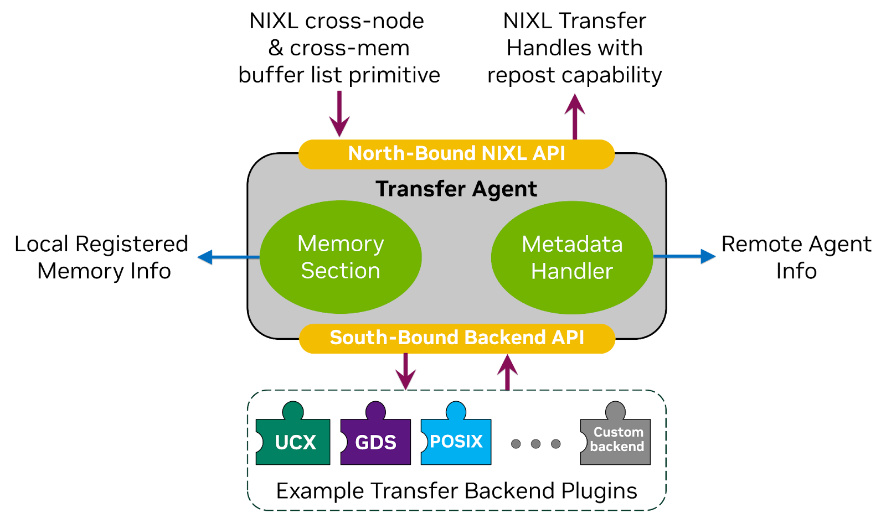
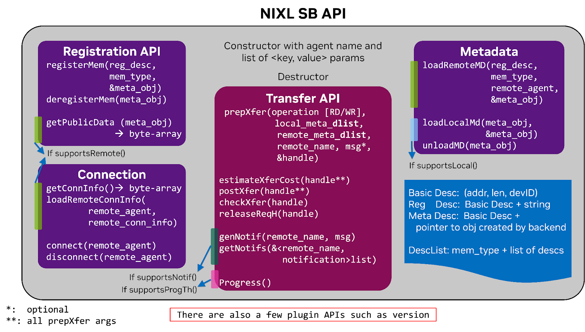

<!--
SPDX-FileCopyrightText: Copyright (c) 2024-2025 NVIDIA CORPORATION & AFFILIATES. All rights reserved.
SPDX-License-Identifier: Apache-2.0

Licensed under the Apache License, Version 2.0 (the "License");
you may not use this file except in compliance with the License.
You may obtain a copy of the License at

http://www.apache.org/licenses/LICENSE-2.0

Unless required by applicable law or agreed to in writing, software
distributed under the License is distributed on an "AS IS" BASIS,
WITHOUT WARRANTIES OR CONDITIONS OF ANY KIND, either express or implied.
See the License for the specific language governing permissions and
limitations under the License.
-->

# NIXL Backend Plugin Interface Overview

NIXL (NVIDIA Inference Xfer Library) is designed to provide high bandwidth, low-latency communication for distributed inference workloads, such as efficient data transfers in scenarios like LLM serving. The library abstracts communication mechanisms and memory access across heterogeneous devices including CPUs, GPUs, and various storage types. This abstraction is presented to the user of NIXL library as its North Bound API (NB API), where they can express transfers requests to NIXL agent through its simple buffer list primitive, and after creation of a request, start the transfer in a non-blocking and asynchronous manner. NIXL delegates the transfer to the optimal backend plugin, resulting in seamless data movement at Speed of Light (SOL) across heterogeneous memory and storage systems.

This is achieved through the South Bound API (SB API) that serves as the standardized interface between NIXL's Transfer Agent and various backend plugins. NIXL agent handles bookkeeping for the local registered memories with backend plugins, as well as managing the required metadata for one-sided transfers, i.e., Read and Write operations, for local or remote transfers. The following diagram further illustrates these components:

Each backend can have unique characteristics and features – for example, UCX is a high-performance communication library, which performs data movement between system and/or GPU memories, while GPUDirect Storage (GDS) can move data between storage disks and GPU memory. To manage a multitude of these transports and ensure the dynamicity of NIXL, the libraries need to be loaded on-demand based on the transport requirement of inference apps. This additional set of APIs for the on-demand requirement, along with the SB APIs, is required to be implemented by a library to be pluggable to NIXL, and hence be called a NIXL Plugin.

Note that plugin implementation is in C++ to achieve SOL, and the header files for the backend plugin can be found in [the backend directory.](https://github.com/ai-dynamo/nixl/tree/main/src/api/cpp/backend)

# The Plugin Architecture and Implementation Overview

NIXL implements a modular plugin architecture where each backend is encapsulated within a library that exposes its features through the SB API, such as [UCX](https://github.com/ai-dynamo/nixl/tree/main/src/plugins/ucx), [GPUDirect Storage (GDS)](https://github.com/ai-dynamo/nixl/tree/main/src/plugins/cuda_gds), or any other custom implementation. The Plugin Manager component within NIXL handles discovery, loading, and instantiation of backend plugins, whether they are dynamically loaded or statically built into the NIXL library. Each plugin needs to implement the SB API, as well as a few methods for the plugin manager, which are discussed in the following sections.

Note that some of the methods in the SB API are not necessary to be implemented, for instance if a backend does not support notifications, it can indicate it through supportsNotif() method, and if it returns false, the agent will not send requests with notifications to this backend. There are 4 such capability indicators, which are detailed further and which APIs are required to be implemented for each of them.

## The South Bound API

For a backend to be compatible with NIXL, it must implement several key SB API methods including:

### Constructor and Destructor:

* Constructor: A key/value set of parameters alongside Agent name is passed to the backend.
* Destructor: Release the remaining resources.

The key/value parameters are a map of strings to byte arrays that are passed from the Agent. These can be whatever the backend needs as its initialization parameters. See the `get_backend_options` plugin API for more detail on how to specify these.

### Capability Indicators:

* supportsLocal(): Indicates if the backend supports transfers within a node
* supportsRemote(): Indicates if the backend supports transfers across nodes
* supportsNotif(): Indicates if the backend supports notifications
* supportsProgressThread(): Indicates if the backend supports progress() method. That method should call the underlying procedure of progressing transfers for this backend.
* getSupportedMems(): Indicates memory types supported by the backend

Based on the first 4 methods (supports*), the required methods to be implemented change. For instance, UCX backend implements all as it supports all scenarios, while GDS backend only has supportsLocal, detailed more in Example implementations. Note that a network backend should have supportsRemote and supportsNotif to be set to true, and preferably supportsLocal also to true, so another backend doesn’t need to be involved for local transfers. For a storage backend, it should have supportsLocal and supportsNotif is optional. supportsProgressThread is optional for both cases. Additionally, a backend that supportsRemote must also support supportNotifs.

Note that supportProgressThread is an indicator whether a backend has implemented the progress() method, but does not imply how the progress thread is implemented. During creation of a backend, the provided init params indicate how the progress thread is intended to be used. For instance, if the enablement of progress thread is set to false, while a backend cannot work without a separate progress thread, the backend creation would fail. This flag is useful for the NIXL agent if we want to provide some agent level guarantees, such as minimum time between calls to progress for backends, or if a central progress method is implemented (for future proofing, not currently implemented).
### Connection Management:

* connect(): Initiates connection to a remote agent.
* disconnect(): Terminates connection with a remote agent
* getConnInfo(): Provides connection information in form of a serialized byte array for remote agents
* loadRemoteConnInfo(): Loads connection information (byte array) received from a remote agent

Some backends require a self connection for loopback, so connect and disconnect is always required, as a backend either supports local or remote communication, or both. However, getConnInfo and loadRemoteConnInfo are required only if supportsRemote is set.

Note that loadRemoteConnInfo does not initiate the connection, if the user wants to pre-establish the connection before the first transfer, there will be a call to the connect method. Another option when connect is called is when the backend has supportsLocal and a connection to the agent itself is called right after instantiation. During the time of the first transfer to an agent, if the connection was not pre-established, the backend should make the connection, either in prepXfer() or postXfer().

### Memory Management:

* registerMem(): Registers memory regions with the backend. Only a single contiguous memory descriptor, alongside the type of memory space is passed.
* deregisterMem(): Deregisters memory regions

Each backend inherits from nixlBackendMD base class to store any metadata required per registration. A pointer to an object of this class will be the output of registerMem, and the only input to deregisterMem.

### Metadata Management:

* getPublicData(): Provide a serialized byte array for remote identifier for a registered memory
* loadRemoteMD(): Loads a remote byte array received from a remote agent
* loadLocalMD(): Loads local memory metadata, directly from local metadata object
* unloadMD(): Releases resources for remote identifier metadata object

Similar to registration, each backend can make a class that inherits from nixlBackendMD to store remote identifiers in a deserialized form from the byte array, achieved by loadRemoteMD. For case of local transfers, the serialization/deserialization part is skipped, so loadLocalMD generates a pointer to an object for the remote identifier, or can output the input pointer for the registered memory.

getPublicData and loadRemoteMD are required if backend supportsRemote, and loadLocalMD is required if backend supportsLocal, and unloadMD is required in all cases to release the deserialized remote identifier object.

### Transfer Operations:

* prepXfer(): Given a descriptor list on each side, read or write operation, and remote agent name (can be loopback to itself if supported), any preparation for a transfer can be performed here, generating a pointer nixlBackendReqH that is a base class to be inherited by the backend for storing state of transfer request.
* estimateXferCost: Given the same info as prepXfer, as well as the transfer request output from prepXfer, the backend can estimate the time of transfer, with noise margin and method of estimation. This is optional.
* postXfer(): Posts a transfer request, meaning the backend should start the transfer. This call is asynchronous, meaning it should not wait to finish the transfer. If the transfer is really small, it’s fine to return DONE right after this call.
* checkXfer(): Checks the status of a transfer request.
* releaseReqH(): Releases a transfer request handle, which should be an extension of the nixlBackendReqH. Note that the NIXL agent may release that handle at a number of error cases, expecting this function to handle proper cancellation of requests in addition to freeing resources.

Within each transfer request, a descriptor list is passed, if there is room for parallelization across different contiguous memory locations, such as across different GPUs (one transfer can expand multiple GPUs). Optionally the user might ask for a notification, which should be sent after all the descriptors within a transfer request are sent. If a backend does not set supportsNotifications, no such notification will be asked.

Note that any transfer request will be prepped only once, but can be posted multiple times, as long as it gets to DONE state before getting reposted. There is no ordering guarantee across transfer requests, and no locking mechanism for any specific memory region; the user is in charge of not corrupting the memory by having two simultaneous transfers to the same location.

Finally, note that a call to releaseXferReq should not block and be asynchronous, especially important to remember when aborting a transfer. This function can return error, meaning it was not successful in aborting the request. If a backend can abort a transfer quickly without a stall, then releaseXferReq can return success right away. Otherwise, one option would be to wait for the transfer to complete. In the meantime, checkXferReq should return error if there was a call to abort which was not successful, while calls to releaseXferReq would return error until the transfer is completed and it returns success. If there is a scenario that a blocking call can abort the transfer before it is completed, then that blocking call can start in a separate thread (or within the progress thread of the backend). In other words, use a blocking call under the hood but provide non-blocking APIs to the user.
### Notification Handling:

* getNotifs(): Gets notifications received from remote agents (or local in case of loopback). The output is a map from remote agent name to a list (vector) of notifications, in the form of byte array.
* genNotif(): Generates a notification to a remote agent, used for control or dummy notifications.

Note that getNotif does not know which agent it should look for to receive the notification. So there should be a method to extract the agent name from the notification received, corresponding to a transfer. genNotif generates a notification which is not bound to any transfers, and does not provide any ordering guarantees. If a backend does not set supportsNotifications, these two methods are not needed.

### Progress Thread:

* progress(): Makes progress on transfers and notifications.

If a backend requires a progress call, such as UCX, to proceed with the transfers, for both check of transfer status or received notification, they can implement a progress thread, and a frequency of waking up that thread will be passed during backend creation. In addition, each time a user calls to check a transfer status, or check received notifications, this method is called, enabling progress if a progress thread is not implemented.

## Descriptor List Abstraction

A key underlying abstraction for NIXL library is a descriptor list, that is made of a memory space (host/GPU/block/File/Obj-Store) and a list of descriptors. There are 2 types of descriptors used for the SB API.

*For transfers: (addr, len, devID, metadata), where metadata is a pointer to an nixlBackendMD object relevant to the registered memory that this descriptor falls within.
*For registration, (addr, len, devID, str) where str is an optional byte-array for extra information. The table below shows the meaning of devID for different memory spaces, as well as optional meaning for File and Object-Store.

| mem type | addr   | len  | devID         | str (byte-array)           |
| -------- | ------ | ---- | ------------- | -------------------------- |
| DRAM     |        |      | 0 (or region) |        -                   |
| VRAM     |        |      | GPU ID        |        -                   |
| BLK      |        |      | Vol ID        |        -                   |
| FILE     | offset | Or 0 | fd            | Path + (access mode)       |
| DRAM     | offset | Or 0 | key           | Extended key (+ bucket ID) |

## Plugin Manager API

From a user perspective talking to the NIXL agent, the type of backend transport is selected, e.g., “UCX” or “GDS”, and NIXL will take care to search for the appropriate plugin, load it into memory, and then create an instance of that backend engine which supports the SB APIs. Within NIXL, there is a main component called the ‘Plugin Manager’ that handles the active discovery, loading, unloading, instance creation of various plugins. When the NIXL library is loaded, the Plugin Manager will read pre-known or configurable directories where NIXL plugins can be present. It then proceeds to verify that the plugin conforms to the set of NIXL APIs by finding dynamically loaded symbols in that library. If these requirements are satisfied, then the Plugin Manager keeps the plugin in memory for the duration of the application. In addition to the southbound API, a plugin needs to implement these methods for the plugin manager:

* get_plugin_name: Returns the name of the backend plugin
* get_plugin_version: Returns the current version of the plugin
* create_engine: Returns an instance of the backend engine
* destroy_engine: Destroys the engine instance
* get_backend_mems: Returns the supported memory types by this backend
* get_backend_options: Returns configuration options and parameters that the plugin can use during initialization. The user can use this information to know such parameters during runtime, and across different versions of the plugin.

The plugin manager maintains API versioning of these above APIs. This can allow NIXL to ensure backward/forward compatibility for many more plugins. Furthermore, there can be both static and dynamic plugins, meaning being auto-loaded and/or built-in into the NIXL library directly or being loaded from disk on-demand respectively. Static plugins can provide slightly better performance at the expense of a larger application size. The API for both options are the same.

## Comparing two plugins as an example

NIXL UCX plugin provides networking across different nodes, while GDS plugin provides storage access. Moreover, UCX plugin sets all of the “supports” flags, while GDS only has the supportsLocal flag set. The reason being UCX requires a progress thread and provides notifications, and can do transfers within an Agent, for instance from GPU to CPU, and across Agents. Therefore, it should implement all of the methods mentioned previously.

However, for NIXL storage backends, there is no need to run a NIXL agent on a remote storage node. Instead, a distributed storage client on the local agent talks to the remote distributed storage, and therefore from NIXL agent point of view for all storage, whether local or remote, it has to talk to this local storage client. In other words, all the transfers are loopback to the agent itself. For the current use case, there is no need for notifications within the same agent, or a progress thread either.

Moreover, the GDS plugin does not require a local connection to itself, so it returns SUCCESS for connect and disconnect, and for loadLocal simply returns back the input pointer as its output. The only 6 remaining methods that it has to implement are:

* registerMem
* deregisterMem
* prepXfer
* postXfer
* checkXfer
* releaseReqH.

# NIXL Agent usage of Plugin manager and SB APIs

In this section we will overview interactions with the NIXL agent from the user point of view, and how they map to the plugin manager and the SB APIs provided by each plugin.

### Create agent:

During this step, some of the configurations are shared among the backend plugins, for instance if use of progress thread is allowed or at what frequency it should be invoked. Also the plugin manager can be called during this step to find the available plugins, so they can be instantiated upon user’s request.

### Create transfer backends:

When user asks for a specific backend for its name, alongside a list of parameters in the form of key-value pairs, NIXL agent will instantiate an instance of that backend plugin through the plugin manager and calls its **initializer** (constructor) method in SB API with the initialization parameters. This includes both the parameters set by the agent during its creation, as well as the parameters passed by the user to this method. Note that there could be errors in such instantiation, and the failure is reported to the user.

In this step, if the plugin supports talking to remote agents, the required connection data for other agents to talk to it is acquired through **getConnInfo** in SB API. And/or if it supports within node transfers, a **connection** call to itself is called, as some backends might require that.

### Make connections (optional):

When a connection is requested to an remote agent, which is possible if the remote agent’s metadata is already loaded, the local Agent would look for common backend plugins between itself and the remote agent, and for each of them initiate a connect by using the **connect** API in SB API of such backends.

### Register (Degister) memory with NIXL:

The agent will receive a list of allocated memories and desired backend from the user, and then will give only one element at a time to the specified backend. Note that backends usually require to register the memories they will access during transfers, and based on that registration keep some metadata for that memory region. For instance, in case of UCX, per each contiguous region of memory, it will produce some local metadata for that region. Agent will give only a single contiguous region of memory to the **register** call in SB API, and in return gets a key (a pointer) to the metadata that backend created for this memory region. Later on, during transfer, the agent will give the same key back to the backend, so backends do not need to do any bookkeeping of such metadata.

If a backend supports within-agent transfers, it might require a different metadata per each registered memory if that memory is the target of an operation, versus the memory that operation is initiated from. Therefore, at this stage the **loadLocalMD** method in SB API is called per each registered memory to acquire such metadata, and the backend returns the key (pointer) to the new metadata object. Similarly, the agent will do the bookkeeping and give the proper metadata during transfer time. Note that the metadata objects can be the same, and therefore both keys point to the same metadata.

For **deregister** call in SB API, the backend will give the key to the metadata object, alongside the original descriptor that the memory was registered with, so the backend can free those metadata.

### Get local agent metadata:

As mentioned earlier, through this API, the serialized form of required information per agent can be obtained. This information includes the connection info per each backend that supports remote Agents, which was acquired during creation of the backend. On top of that, per each registered memory with each backend, they can provide some remote identifiers, so their counterpart backend in another agent can access their memories. For instance, if GPU0 in Agent A wants to send some data to GPU2 in Agent B through the UCX backend, Agent A needs the required local metadata related to the data in local GPU0, as well as the remote identifier for the destination in Agent B’s GPU2, to be able to conduct the transfer. To get the remote identifier information, the agent will call **getPublicData** in SB API for each registered memory of each backend and get the serialized output for each. Finally the agent will do a serialization of all the connection and registered memory remote identifiers across the backends, alongside some extra metadata such as its own name, to produce the complete metadata object in a serialized format. Note that **getConnInfo** can be used here as well, just since we don’t expect backends to change their connection info after creation, we did it at the time of backend creation in our implementation.

### Load remote agent metadata:

When metadata of a remote agent is received in a serialized format, agent will parse the information and deserialize it. Per each connection info of each backend, if such backend is available locally, it will call **loadRemoteConnInfo** in SB API of that backend with the connection info of its counterpart in the remote agent, so later the local backend can communicate with the remote backend. Furthermore, per each piece of registered memory of a remote backend that has a counterpart available locally, its registered memory information alongside the serialized remote identifier information is given to the local backend engine through **loadRemoteMD** in SB API, which will generate a metadata object and return its key (pointer), similar to a target metadata object explained in register memory for local transfers. Similarly during the time of transfer, the agent will provide the proper metadata object key.

Note that after this step, if there was at least one backend in common between the two agents, there can be transfers between the two agents.

### Invalidate remote agent metadata

Agent will determine which backends were common during the time of loading remote metadata of that specific agent, and call **disconnect** in SB API to that agent for such backends. Also, for each of the remote identifiers stored for that remote agent for the corresponding common backends, it will call the **unloadMD** in SB API to release the resources.

Note that after this step, the local agent cannot initiate transfers to the remote agent anymore, until its metadata is reloaded again. Through these two methods the dynamicity requirement of NIXL agents are achieved.

Regarding marginal updates, they only require some extra bookkeeping within the agent, and central KV service mode is just the interface between the agent and central metadata server, and does not change how the SB APIs are used.

### Create transfer request:

This API does the preparations on the agent side and does not call the backend SB API. However, it decides which backend to choose (unless optionally specified by the user). If a backend is not specified, the agent will look at the memory types of the request on both sides, the available backend engines on both sides, as well as the memory ranges registered with each backend for that specific memory type. Usually considering all these factors only a single backend can deliver the transfer request, otherwise we select the first match, or use a preference list.

In addition to finding the best backend, this API does several checks, such as the request being proper in size, or the memory regions being available in the optional passed backend. Then it will populate each descriptor within the list on each side with the relevant metadata object key received from the backend, which can be different whether the element is on the initiator side of the transfer, or the target side, even for the within-agent transfers. After all the checks and preparations are done, a handle is returned to the user, which has all the required information for the backend engine to perform the transfer. Note that at this stage a transfer is not initiated.

### Post transfer request:

A post transfer is called on a prepared transfer handle. Already the transfer backend is determined, and all the required metadata keys (pointers) are attached to the request. So a single call to **postXferReq** in SB API for the corresponding backend is the main goal of this function. This call will result in a backend engine specific transfer handle, which later the agent can use to ask for the transfer status. Note that this method can be called on the same agent transfer handle after the transfer is done, and it is up to the backend to create a new transfer handle each time a new transfer is started, or reuse the old one. Also if there is a transfer in progress, and a post is submitted for that, it will cause an error and potentially abort the transfer.

Note that inside a transfer, a backend might provide methods for network resiliency or optimizations, such as load balancing different transfers, within the same descriptor list of a single transfer, or across different transfers. This is handled and implemented by the backend plugin.

### Get transfer status:

The agent will call the backend specific transfer handle that is stored within the agent transfer handle, and check the status of the transfer. This is achieved through a call to **checkXfer** in the SB API. Internal to the backend, they can call the **progress** method in SB API, if that’s necessary to get the latest status of the transfers. If the agent is run in progress thread mode, the agent will call that periodically, and therefore reduce the load on this internal call.

### Invalidate transfer request:

The agent will call the **releaseReqH** from the SB API on the backend specific transfer handle to release it, and potentially abort the transfer if in progress and the backend has the capability. Then the agent will release the other resources within the agent level transfer handle to fully release it.

### Get notifications:

The agent will iterate over all the backends that support notification, and call their **getNotifs** from the SB API, which will return a list of notifications received from each remote node between the previous call to this method and this time. Then the agent will merge the results from all such backends, and append them to the map that the user has provided. Similar to get transfer status, Internal to the backend, they can call the **progress** method in SB API, if that’s necessary to get the latest notifications received from the transfers initiated by the other agents towards them. If the agent is run in progress thread mode, the agent will call that periodically, and therefore reduce the load on this internal call.

### Generate notification:

If a backend is provided by the user, the agent will call **genNotif** from the SB API of that backend engine. Otherwise, it will look for a backend that is available locally and remotely and also supports notifications. If more than one candidate is found, it will choose the first one, or use a preference list.

### Destructor:

When an agent is getting destroyed at the end of the application, it will deregister all the remaining memories that were not deregistered by the application (bad practice, but agent takes care of it). Then for each of the backends it will call their **destructor** from the SB API, and finally do the rest of internal clean up.