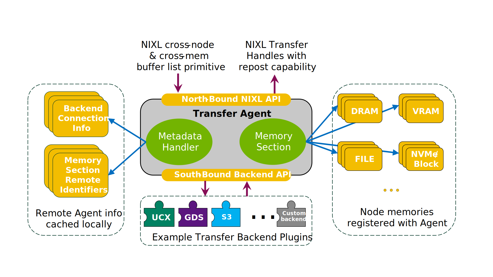
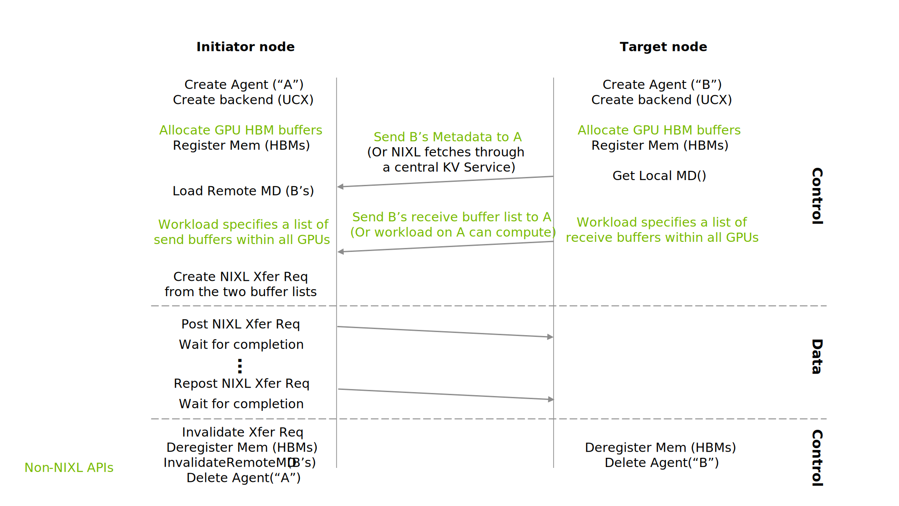

<!--
SPDX-FileCopyrightText: Copyright (c) 2024-2025 NVIDIA CORPORATION & AFFILIATES. All rights reserved.
SPDX-License-Identifier: Apache-2.0

Licensed under the Apache License, Version 2.0 (the "License");
you may not use this file except in compliance with the License.
You may obtain a copy of the License at

http://www.apache.org/licenses/LICENSE-2.0

Unless required by applicable law or agreed to in writing, software
distributed under the License is distributed on an "AS IS" BASIS,
WITHOUT WARRANTIES OR CONDITIONS OF ANY KIND, either express or implied.
See the License for the specific language governing permissions and
limitations under the License.
-->
# NVIDIA Inference Xfer Library (NIXL)
NIXL is targeted for accelerating point to point communications in AI inference frameworks such as [NVIDIA Dynamo](https://github.com/ai-dynamo/dynamo), while providing an abstraction over various types of memory (e.g., CPU and GPU) and storage (e.g., file, block and object store) through a modular plug-in architecture.

# Background
Distributed inference workloads present complex challenges for systems, including but not limited to networking and communication issues. These challenges encompass high-performance requirements, heterogeneous data paths that span both memory and storage, and the need for dynamic scaling up and down.

NIXL is designed to support inference frameworks by addressing their challenges while delivering high-bandwidth, low-latency point-to-point data transfers. It offers a unified abstraction across various memory types, including HBM, DRAM, local or remote SSDs, and distributed storage systems, through a versatile API. This API can support multiple backend plugins like UCX, GDS, S3, and other protocols or clients. Furthermore, NIXL abstracts away additional backend specifics, such as connection management, addressing schemes, and memory characteristics, to streamline integration with inference frameworks.

# Overview

The following figure illustrates NIXL's relationship to inference server stacks. NIXL functions as a standalone library, providing the necessary abstraction for various network and storage backends to support the data plane operations of distributed inference platforms, such as NVIDIA Dynamo. The backends that were considered in NIXL's design include, but are not limited to, [UCX](https://github.com/openucx/ucx), [NVIDIA Magnum IO GPUDirect Storage](https://docs.nvidia.com/gpudirect-storage/overview-guide/index.html), file systems (including DFS), block and object storage. NIXL offers generic interfaces capable of supporting data transfers in the form of tensors, bytes, or objects.



NIXL operates under the assumption that it is managed by a conductor process responsible for orchestrating the inference process. This includes tasks such as handling user request data and exchanging the necessary serialized metadata.


# Design
NIXL's Transfer Agent abstracts away three key categories of information:

1. [Memory Section](#memory-sections): Unifies various types of memory and storage, allowing the agent to accept a buffer list primitive for transactions regardless of the memory type.
2. [Transfer Backend Interface](#transfer-backend-interface): Abstracts different transfer backends from the agent, facilitating transfers between various memory and storage device types.
3. [Metadata Handler](#metadata-handler): Provides a serialized form of necessary information for each agent, enabling communication between agents. It also caches required remote agent information for the local agent.

Using these components, the NIXL Transfer Agent provides a desired interface by receiving a buffer list primitive from the distributed inference platform and returning an asynchronous handle to check the status. The agent supports multiple backends, allowing seamless data movement via [RoCE](https://docs.nvidia.com/networking/display/ofedv502180/rdma+over+converged+ethernet+(roce)), [Infiniband](https://www.nvidia.com/en-us/networking/products/infiniband/), [GPUDirect RDMA](https://developer.nvidia.com/gpudirect), NVMe-oF, TCP, and potentially file system emulation. NIXL determines the optimal transfer backend based on the memory types used in a transfer. For example, if the source is DRAM and the target is VRAM, UCX might be used. If the transfer involves VRAM as the source and PFS as the backend, GPUDirect Storage APIs could be employed. In cases where multiple backends support the memory types, NIXL internally decides which one to use.

An agent serves as the NIXL representative within the central process running the inference service. In a distributed inference setup, the NIXL library is integrated into the main conductor process per node, where an agent can manage multiple devices. For instance, on a DGX server, a single agent in the main conductor process can access several GPUs and other memory or storage nodes. Each agent is identified by a unique and global ID/name assigned by the inference platform.

### Memory Sections
A Memory Section represents a collection of address ranges registered with the agent. NIXL supports multiple segment types, including DRAM, VRAM, NVMe-oF, Object storage, and File. It can also encompass address ranges from various memory and storage types. The Memory Section manages the necessary local private information for the transfer backend engines and provides the required details for remote agents to connect with these backends.

### Transfer Backend Interface
During initialization, each transfer backend must be registered with the transfer agent. This registration process enables the transfer agent to gather sufficient information to determine the most suitable backend for a transfer based on memory section descriptors. It is possible for the same memory location to be registered with multiple backends, and the NIXL agent will select the optimal one based on the source and destination memory types, as well as the available backends on the remote node.

### Metadata Handler
The Metadata Handler manages the metadata necessary for establishing transfers between the initiating transfer agent and the target agent. This metadata can be exchanged via a side channel or through a centralized metadata server like etcd or Redis. The serialized metadata includes connection information for each backend and remote identifiers for different registered memories and regions within the memory section. However, it excludes local private information stored in the memory section per backend, only including the remote identifiers needed for the target agent's backend to connect and initiate transfers.
When loading the metadata, the backend type that generated the remote identifiers is included. This ensures that the received metadata is routed to the appropriate backend on the receiving agent. If that backend is not available, the relevant metadata portion is ignored.

For example, a memory section tagged with UCX indicates it was generated by a UCX backend engine and should be delivered to a UCX backend engine on the receiving agent, if present.

In the default mode of operation, this metadata exchange does not occur on the data path. Memories are registered with the agent at the start of the inference process, and metadata is exchanged only once.

A caching mechanism updates or invalidates cached metadata from each remote agent, eliminating the need to fetch the same metadata for each transaction. This caching mechanism also supports the dynamic nature of inference workloads. An agent can be added by providing its metadata to the agents that need to communicate with it. Conversely, an agent can be removed by invalidating the cached values that previously interacted with it.

# Example procedure
The following image shows a basic example of how to use NIXL between 2 nodes. The API usage is further reviewed in three parts: initialization, transfer, and dynamicity.



## Initialization
For each node in the system, runtime creates an agent, and if necessary gives the list of devices to it (not shown in the above example). Then for each transfer_backend that is supported for the system, it calls the create_transfer_backend API. Next, the memories regions that are going to be used are registered with each relevant backend. For instance, in the above example we register all GPU HBM memories with UCX.


```
# list of devices (GPUs, DRAM, NICs, NVMe, etc)
create_agent(name, optional_devices)

# User allocates memory from their preferred devices -> alloced_mem
foreach transfer_backend:
    create_transfer_backend(corresponding_backend_init)
    foreach alloced_mem: # If they are relevant for that backend
        register_memory (desc, backend)
```

## Metadata Exchange
Once backends and memory regions are registered with NIXL, the runtime requests the metadata for each agent, either directly or by sending it to a central metadata server. This metadata is necessary for initiator agents to connect to target agents and facilitate data transfers between them. In the example provided, metadata is exchanged directly without a metadata server. However, agent A's metadata can also be sent to agent B if B needs to initiate a transfer to A.
Following the metadata exchange, which includes connection information for each registered backend, the runtime can proactively call the make_connection API using the target agent's name if the agents involved in the transfer are known in advance. Otherwise, the connection is established during the first transfer.

### Side channel
```
# In each agent:
get_local_metadata()

# Exchange the metadata to the desired agents

# In each agent:
    for each received metadata:
        remote_agent_name = load_remote_metadata()
        make_connection(remote_agent_name) # optional

```

### Central metadata
```
# In each agent:
    send_local_metadata()

for each target_agent:
    fetch_remote_metadata(target_agent_name)
    make_connection(remote_agent_name) # optional
```

## Transfer
To initiate a transfer, both the initiator and target agents need to provide a descriptor (buffer) list, which can be sent by the runtime from the target to the initiator agent. Using these descriptor lists, along with the target agent's name and the transfer operation (read or write), a transfer can be created, returning a transfer handle. Optionally, a notification message can be specified for the operation.

The create_transfer_request function performs the necessary checks for the transfer and determines which backend will be used. If successful, the runtime can post a transfer request on the received handle as many times as needed. The status of the transfer can be checked using the get_transfer_status function. In the example provided, the process blocks on the transfer checks since it is the only transfer in the system and there is no computation to overlap it with.

```
# On initiator agent
hdl = create_transfer_request(local_descs, target_descs,
	        		      target_agent_name, notif_msg,
                              operation (RD/WR))

# Example of reposting the same transfer request
for n iterations:
    post_transfer_request(hdl)
    while (get_transfer_status(hdl) != complete):
        # do other tasks, non-blocking

```

## Dynamic scaling
Adding a new agent to a service involves creating the agent and exchanging its metadata with the existing agents in the service. To remove an agent or handle a failure, you can use one of the metadata invalidate APIs. This triggers disconnections for backends connected to the agent and purges the cached metadata values.

### Side channel

```
# In each agent (the connected ones or all, both options are fine)
invalidate_remote_agent(remote_agent_name)

# In case of failure, the heartbeat system sends this message
# to connected or all agents through the side channel control
```

### Central metadata

```
# In the agent that is going to be removed
Invalidate local agent metadata()

# In case of failure, the heartbeat system sends this message
# to the central metadata server
```

## Teardown
Similar to removing an agent, invalidating an agent's metadata is necessary through one of the two APIs. When an agent is destroyed (via its destructor), it deregisters all registered memory regions with the backends, calls destructors of each backend which invalidate their internal transfer states, and releases other internal resources in the agent.

### Side channel

```
# In each agent (the connected ones or all, both options are fine)
invalidate_remote_agent(remote_agent_name)

# In the agent that is going to be deleted
delete agent
```

### Central metadata

```
# In the agent that is going to be removed
Invalidate local agent metadata()
detete agent
```
